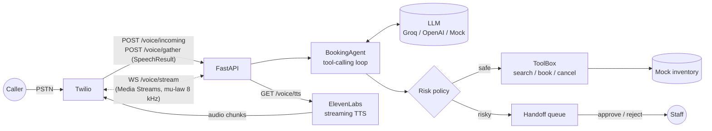

# Voice Booking Agent

A phone receptionist you can call. It answers through **Twilio**, understands the caller, uses an **LLM with tool calls** to search, book and cancel appointments over a (mock) inventory, speaks back with **ElevenLabs streaming TTS**, and **hands risky actions to a human** instead of doing them itself.

Every external service is optional. With no keys set, the app runs end to end in **mock mode**: a rule-based LLM stand-in, Twilio `<Say>` instead of ElevenLabs, and a local inventory. So you can clone it, run the tests, and walk through a call in under a minute.

## Features

- **FastAPI webhooks for Twilio Voice**: a TwiML `<Gather input="speech">` loop for turn-by-turn calls, plus a bidirectional **Media Streams** WebSocket that streams 8 kHz mu-law audio back into the call
- **ElevenLabs streaming TTS**: audio is streamed to Twilio's `<Play>` as it is generated (`mp3`), or pushed frame by frame into Media Streams (`ulaw_8000`)
- **Tool-calling agent** using the OpenAI chat-completions format, so it works with Groq, OpenAI or any compatible endpoint: `search_availability`, `create_booking`, `cancel_booking`
- **Human-handoff policy**: cancellations and bookings above a price limit are never executed by the model. They become pending handoffs that a person approves or rejects (`/handoffs`), and the call can be `<Dial>`ed to a human
- **Twilio signature validation** (`X-Twilio-Signature`) when `TWILIO_AUTH_TOKEN` is set
- A `/chat` text endpoint into the same agent for testing without a phone

## Architecture



**Call flow (TwiML mode):** Twilio posts the call to `/voice/incoming`, which returns a `<Gather>` with the greeting. Twilio transcribes the caller and posts `SpeechResult` to `/voice/gather`. The agent runs its tool loop and replies, and the reply is voiced by `<Play>` from `/voice/tts` (ElevenLabs) or `<Say>` (mock). If the agent raised a handoff and `HUMAN_AGENT_NUMBER` is set, the call is transferred with `<Dial>`.

**Media Streams mode:** point Twilio at `/voice/incoming-stream`. It returns `<Connect><Stream>` to `wss://.../voice/stream`. The greeting is streamed into the call as mu-law frames as soon as the stream starts. Caller audio arrives as `media` events: plug a streaming STT into the `on_media` hook, or post transcripts as `{"event": "transcript", "text": "..."}` and the agent's reply is streamed back.

## Project layout

```
app/
  main.py          FastAPI app factory, /chat, /handoffs, /health
  twilio_voice.py  TwiML webhooks, /voice/tts, Media Streams WebSocket, signature check
  agent.py         LLM tool-calling loop + human-handoff gate
  tools.py         Tool JSON schemas, execution, risk policy
  llm.py           OpenAI-compatible client + offline MockLLM
  tts.py           ElevenLabs streaming client + MockTTS
  inventory.py     Thread-safe in-memory slots and bookings (mock data)
  config.py        Settings from environment
scripts/demo.py    Scripted call in the terminal
tests/             pytest suite (runs fully offline)
```

## Setup

```bash
git clone https://github.com/Manohar8142/voice-booking-agent.git
cd voice-booking-agent
python -m venv .venv && source .venv/bin/activate   # Windows: .venv\Scripts\activate
pip install -r requirements.txt
cp .env.example .env        # optional: fill keys to leave mock mode
pytest
uvicorn app.main:app --reload
```

### Connect a real phone number

1. Expose the server: `ngrok http 8000`, and set `PUBLIC_BASE_URL` to the https URL.
2. In the Twilio console, set your number's **A call comes in** webhook to `POST {PUBLIC_BASE_URL}/voice/incoming` (or `/voice/incoming-stream` for Media Streams).
3. Set `TWILIO_AUTH_TOKEN` to enable signature validation, and `ELEVENLABS_API_KEY` for ElevenLabs voices.

## Environment variables

| Variable | Default | Purpose |
|---|---|---|
| `LLM_API_KEY` | empty (mock) | Key for the OpenAI-compatible endpoint |
| `LLM_BASE_URL` | `https://api.groq.com/openai/v1` | Chat-completions base URL |
| `LLM_MODEL` | `llama-3.3-70b-versatile` | Model name |
| `ELEVENLABS_API_KEY` | empty (mock) | Enables ElevenLabs TTS |
| `ELEVENLABS_VOICE_ID` | `21m00Tcm4TlvDq8ikWAM` | Voice to use |
| `ELEVENLABS_MODEL` | `eleven_flash_v2_5` | Low-latency TTS model |
| `TWILIO_AUTH_TOKEN` | empty | Enables webhook signature validation |
| `PUBLIC_BASE_URL` | `http://localhost:8000` | URL Twilio uses to reach the app |
| `HUMAN_AGENT_NUMBER` | empty | Number to transfer to on handoff |
| `HANDOFF_AMOUNT_THRESHOLD` | `500` | Bookings above this need human approval |

## Usage

Scripted call in the terminal:

```bash
python scripts/demo.py
```

Text channel over HTTP:

```bash
curl -s localhost:8000/chat -H 'content-type: application/json' \
  -d '{"session_id":"c1","text":"Hi, my name is Priya. Any haircut tomorrow?"}'
curl -s localhost:8000/handoffs                         # pending human approvals
curl -s -X POST localhost:8000/handoffs/<id>/approve    # or /reject
```

Simulate a Twilio webhook:

```bash
curl -s -X POST localhost:8000/voice/gather -d CallSid=CA1 -d "SpeechResult=massage tomorrow, I'm Sam"
```

## Example output

Mock mode, `python scripts/demo.py` (dates are relative to the day you run it):

```
CALLER: Hi, my name is Priya. Do you have a haircut tomorrow?
   [tool] search_availability({'service': 'haircut', 'day': '2026-10-08'})
AGENT:  I have 4 openings. The first few are: 2026-10-08 at 10:00 (slot S001, 25 dollars); 2026-10-08 at 11:30 (slot S002, 25 dollars); 2026-10-08 at 14:00 (slot S003, 25 dollars). Which one should I book?

CALLER: Yes, book the first one.
   [tool] create_booking({'slot_id': 'S001', 'customer_name': 'Priya', 'phone': '+15550100'})
AGENT:  You're booked, Priya: haircut on 2026-10-08 at 10:00. Your booking number is B1001.

CALLER: Actually, please cancel booking B1001.
   [tool] cancel_booking({'booking_id': 'B1001'})
   [handoff] a36d27ce: Cancellations are irreversible and require a human to confirm.
AGENT:  I've passed that to a team member to confirm, because: Cancellations are irreversible and require a human to confirm. They'll follow up shortly.

[human approved a36d27ce] -> {'ok': True, 'booking': {'booking_id': 'B1001', 'slot_id': 'S001', 'customer_name': 'Priya', 'phone': '+15550100', 'status': 'cancelled'}}
```

## Tests

```bash
pytest -q
```

Covers the search, book and cancel flow, the price-limit handoff, the TwiML loop, the Media Streams audio path and Twilio signature validation, all offline.

## Notes and limits

- Inventory and bookings are in memory and reset on restart. Swap `Inventory` for a database-backed class with the same methods.
- In Media Streams mode, inbound speech-to-text is a hook, not a bundled provider.
- The mock LLM is a deterministic rule set for demos and tests, not a language model.

## License

MIT, see [LICENSE](LICENSE).
